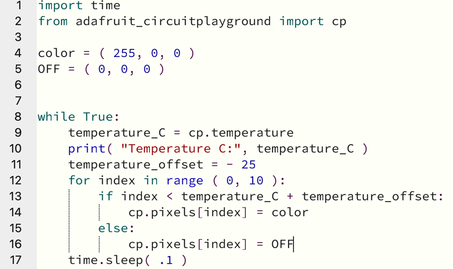
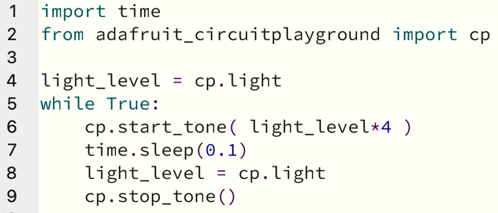
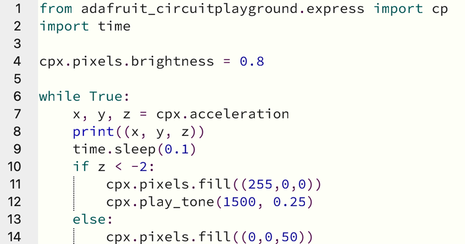
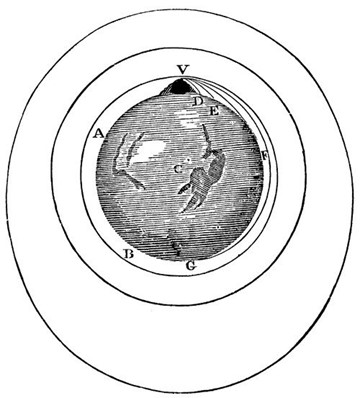
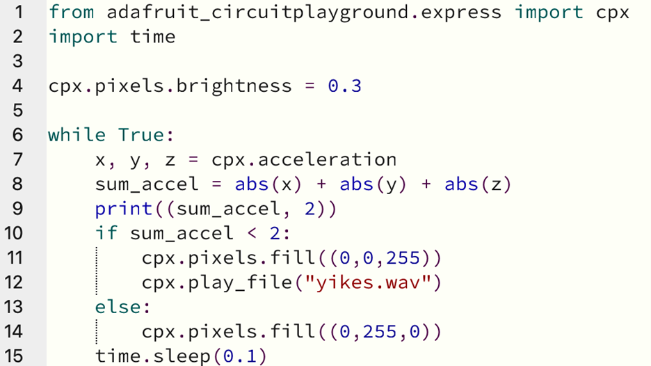

# Micro-Instrumentation: Circuit Playground Express 

This repository is a collection of code examples a user can load onto the Circuit Playground Express to create examples of scientific instruments. A scientific instrument is something that quantifies a physical phenomenon and finds a way to tell you about that quantity.

We can make some interesting scientific instruments using the hardware on the Circuit Playground Express by Adafruit Industries. Hardware, in this sense, is the set of electronic components on the Circuit Playground Express. We will write the software to make the hardware into an instrument.

## Device Setup 
We will work in Circuit Python, a variant of the Python programming language. So, first, we need to put Circuit Python onto the Circuit Playground Express.

Plug your Circuit Playground Express (CPX) into your computer's USB port. Set the CPX off to the side, not on your computer, so you don't cause unwanted electrical connections between the two. If your CPX is new, you should see a cycle of rainbow lights. There is a small button close to the center of the CPX, labelled "reset". Press it once, and all the lights should turn red. Now it is ready to receive Circuit Python. (If it doesn't show rainbow lights, or one press doesn't work, try double-clicking the button to get the lights to turn red.) An external drive called CPLAYBOOT should show up on your computer.

Use your computer to navigate to [https://circuitpython.org/downloads](https://circuitpython.org/downloads) and click on the Circuit Playground Express. Download the current uf2 file at the DOWNLOAD UF2 NOW button. Copy that file to the CPLAYBOOT drive, which will then disappear and be replaced by a drive called CIRCUITPY.

Now, use your computer to navigate to [https://codewith.mu](https://codewith.mu). Select Downloads and install the version that is correct for your operating system.

Now we can program the CPX from the computer. Click on the Serial button in the Mu Editor to see the output from the CPX. Click in the serial panel and press ctrl and c to stop a program, and ctrl and d to restart a program. Click the Load button to see what code is on the CPX.

## 1. Thermal Runaway with LED's
Let's put our own code on the CPX. Navigate to the "thermal_runaway" directory within this repository and copy the "code.py" file to the CIRCUITPY drive, replacing the one that is already there. 
This code uses the temperature sensor, and the LED lights to indicate the temperature. The code looks like this:

 

Each light represents one degree C, starting at 25.

Since internal body temperature is around 37 C, if you press on the sensor with your warm finger, the temperature will go up, and more lights will come on to show that. You can read the temperature in the serial panel in the Mu Editor.

The lights give off some heat of their own when they are on, so they tend to heat up the CPX, which increases the temperature reading, which causes more lights to show. More lights make more heat, and so on. This condition is known as thermal runaway and is a very important safety concept for battery circuits in cars and aircraft and so on.

### Code Breakdown:
1.	`import time` -- we access a library of code with time functions in it, so we can use time.sleep() in line 17.
2.	`from adafruit_circuitplayground import cp` -- we access a library of code with CPX hardware functions in it, so we can use the thermometer sensor and the lights.
3.	blank line
4.	`color = ( 255, 0, 0 )` -- Here we set the color we are going to use for the LED lights. The range is 0 to 255, and the order is (red, green, blue).
5.	`OFF = ( 0, 0, 0 )` -- we set a constant for the color of the off condition
6.	blank line
7.	blank line
8.	`while True:` -- the while condition repeats the following lines as long as the condition is true and stops when the condition is false. Since the constant True is always true, this loop will run forever, so long as the unit has power.
9.	`temperature_C = cp.temperature` -- here is where we read the temperature sensor, which reports in degrees C, so we put that number into a new variable that is named for the information it carries.
10.	`print( "Temperature C:", temperature_C )` -- prints this information over the serial link, for use when the unit is connected to a computer.
11.	`temperature_offset = - 25` -- since we are expecting temperatures not far from room temperature, we subtract 25 to bring the temperature scale onto the lights in a meaningful way, from 25 to 35 on the ten lights.
12.	`for index in range ( 0, 10 ):` -- set up a "for" loop that counts from 0 to 10, for the 10 lights
13.	`if index < temperature_C + temperature_offset:` -- if the index is less than the temperature after we apply the offset....
14.	`cp.pixels\[index\] = color` -- set that particular light specified by the index to the color we specified in line 4.
15.	`else:` -- if not....
16.	`cp.pixels\[index\] = OFF` -- turn that light off
17.	`time.sleep( .1 )` -- slow down the loop so that the processor is working at the scale of human perception, not running as fast as it possibly can for no good purpose.

## 2. Audio Guided Light Sensor 
Now let's try a different instrument. This one uses the light sensor and plays audible tones to guide the user to point the sensor toward the brightest light available. Higher pitch tones indicate greater brightness.

To run the light finder instrument, navigate to the "light_finder" directory within this repository and copy the "code.py" file to the CIRCUITPY drive, replacing the one that is already there.  

 

### Code breakdown:
1.	`import time` -- we access a library of code with time functions in it, so we can use time.sleep() in line 17.
2.	`from adafruit_circuitplayground import cp` -- we access a library of code with CPX hardware functions in it, so we can use the thermometer sensor and the lights.
3.	blank line
4.	`light_level = cp.light` -- read the light sensor and store the reading in the light_level variable.
5.	`while True:` -- the while condition repeats the following lines as long as the condition is true and stops when the condition is false. Since the constant True is always true, this loop will run forever, so long as the unit has power.
6.	`cp.start_tone( light_level*4 )` -- start to play a tone that has a pitch that is 4 times the brightness value. I chose 4 because it makes the tones come out in the range that is easy to hear.
7.	`time.sleep(0.1)` -- wait for 1/10 second while the tone is playing. The tone library isn't fast, so we need to give it some time to hear the tone.
8.	`light_level = cp.light` -- read the light level again, to update the reading.
9.	`cp.stop_tone()` -- stop playing the tone.

## 3. Detecting Gravity with an Accelerometer 
Now let's read the on-board accelerometer and use it to detect gravity, which behaves similarly to acceleration. To do this, we will test if the circuit board is upright, with the components on top. If the circuit board is overturned, we will give a warning tone. We will also use the LED lights to indicate the state; upright or overturned.

The gravity equivalent of acceleration at earth's surface is 9.8 m/s^2, so we will look for anything less than -2 to check for the upside-down condition. Completely upside-down will give a reading of -9.8 in the z direction of the accelerometer sensor.

To run the overturn warning instrument, download the code.py file from here (future link). Copy the code to the CIRCUITPY drive, replacing the one that is already there.

  

### Code breakdown:
Lines 1, 2, and 3 are equivalent to those in the previous program.
4.	`cpx.pixels.brightness = 0.8` -- set the overall brightness of the lights, from 0.0 to 1.0
5.	blank line
6.	`while True:` -- the same infinite loop pattern as used earlier.
7.	`x, y, z = cpx.acceleration` -- read the accelerometer and break it out into x, y, and z components.
8.	`print((x, y, z))` -- Print the acceleration values over the USB to the computer. You can use the Plotter button to see a plot of all three numbers, which is useful for understanding how motion affects acceleration.
9.	`time.sleep(0.1)` -- slow down the loop a little.
10.	`if z < -2:` -- check to see if the unit is upside down, when z is more negative than -2.
11.	`cpx.pixels.fill((255,0,0))`-- if line 10 is true, show red lights.
12.	`cpx.play_tone(1500, 0.25)` -- and play a warning tone for 1/4 of a second.
13.	`else:` -- if line 10 is false...
14.	`cpx.pixels.fill((0,0,50))` -- light up in a pale blue color.

## 4. Free Fall Detection 
For this one, we will want the 3xAAA battery pack and a piece of double stick tape to mount the pack to the rear, flat side of the board. That way the instrument can run without being plugged into the computer.

Isaac Newton imagined a cannon on a mountain top.

Any cannonball, or any object in free fall, is in orbit. The earth usually gets in the way of orbit, but, nonetheless, when the falling acceleration equals the gravitational acceleration, the object is briefly in orbit. If you can get it going fast enough sideways that the curve of the fall equals or is greater than the curve of the planet, then you have true orbit.

We will set the instrument to let us know when it's in free fall, when the gravity and the falling acceleration cancel each other out. Gently toss the unit upwards, or sideways, or simply drop it, and you can see what the orbital path looks like. The unit will play a cartoon voice saying "Yikes! And away!" and the lights will change from green to blue while the unit is in free fall.

To run the free fall detection instrument, download the code.py file and the yikes.wav file from here (future link). Copy the code to the CIRCUITPY drive, replacing the one that is already there, and copy the .wav file to the CIRCUITPY drive, too.

### Code breakdown:
Lines 1-7 are equivalent to those in the previous program.
8.	`sum_accel = abs(x) + abs(y) + abs(z)` -- a quick way to see if there is any acceleration at all is to simply add the absolute values of each direction. A vector sum would be more correct, and also work, but this is easier and works fine for our free fall test.
9.	`print((sum_accel, 2))` -- print the simple sum, and the threshold value we will use in the line below, so that you can use the plotter to see the action, when plugged in.
10.	`if sum_accel < 2:` -- if we are close enough to free fall...
11.	`cpx.pixels.fill((0,0,255))` -- turn on the blue lights, and...
12.	`cpx.play_file("yikes.wav")` -- play the cartoon voice
13.	`else: otherwise,` if we are not in free fall...
14.	`cpx.pixels.fill((0,255,0))` -- show green lights
15.	`time.sleep(0.1)` -- slow down the loop a little.

